```mermaid
mindmap
  root((StermSo))
    编程
      Web
      SEO
      LLMs
    音乐
      古典
      流行
      摇滚
      说唱
      纯音乐
    旅行
      北京
      天津
      武汉
      长沙
      厦门
      广州
      哈尔滨
    阅读
      思想
      哲学
      社会科学总论
      政治法律
      经济
      工业技术
```

<!--模块一 : https://github.com/matyo91 | https://codesandbox.io/s/github-profile-2ijk7 -->
<!--First Module : https://github.com/matyo91 | https://codesandbox.io/s/github-profile-2ijk7-->

 
<!--模块二 : https://shields.io-->
<!--Second Module : https://shields.io-->

<!--访客|Visitors-->
<!--分叉|Github Forks-->
<!--收藏|Github Stars-->
<!--关注|Github Followers-->
<!--赞助|Github Sponsors-->

<!--模块三 : https://github.com/sun0225SUN/sun0225SUN-->
<!--Third Module : https://github.com/sun0225SUN/sun0225SUN-->

<!--Github贡献热力图|Github Contributions-->

 
<!--模块四 : Mermaid-->
<!--Fourth Module : Mermaid-->
<h1>🧑‍💻  AboutMe  🧑‍💻</h1>
 

<!--模块五 : https://shields.io-->
<!--Fifth Module : https://shields.io-->

------------------------------

<h3>🪧  编程语言  🪧</h3>
<h3>🪧  Programming Language  🪧</h3>

  
<!--模块六 : -->
<!--Sixth Module : svg-->

------------------------------

<h3>🖽  编程框架  🖽</h3>
<h3>🖽  Programming Framework  🖽</h3>

&nbsp;

&nbsp;

&nbsp;

&nbsp;

  
<!--模块七 : -->
<!--Seventh Module : -->

------------------------------

<h3>🧰  工具和环境  🧰</h3>
<h3>🧰  Tools And Enviroments  🧰</h3>

 

&nbsp;

&nbsp;

 

------------------------------

<!--
**stermso/stermso** is a ✨ _special_ ✨ repository because its `README.md` (this file) appears on your GitHub profile.

Here are some ideas to get you started:

- 🔭 I’m currently working on ...
- 🌱 I’m currently learning ...
- 👯 I’m looking to collaborate on ...
- 🤔 I’m looking for help with ...
- 💬 Ask me about ...
- 📫 How to reach me: ...
- 😄 Pronouns: ...
- ⚡ Fun fact: ...
-->
